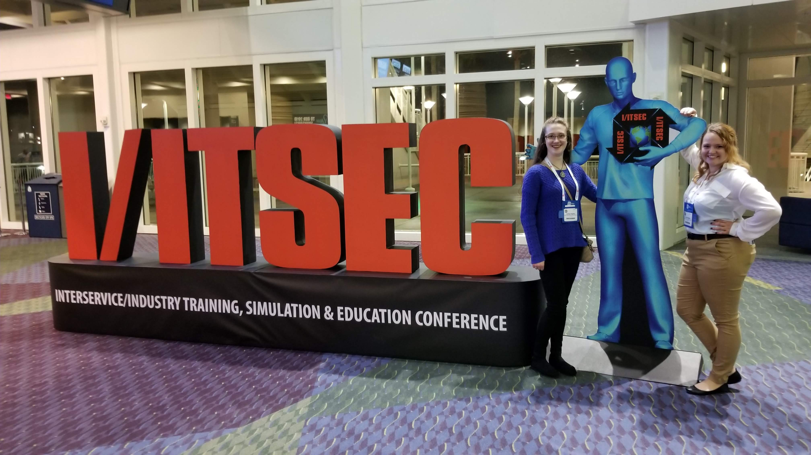

# Rosati-Kain I/ITSEC 2019 Future Leader Pavilion

In 2019, John mentored the Rosati-Kain Catholic High School in their participation at the Future Leaders Pavilion at the I/ITSEC conference.  This program is a STEM outreach effort by the conference to attract interest at the High School level.

Students from around the country create a project, write a paper on their work, and present their efforts at the conference.  They speak one-on-one with leaders from around the world to demonstrate their work and gain vaulable insight and professional experience in this unique venue.

Carolyn Aughey (my daughter), and Frankie , seniors at Rosati-Kain High School, traveled to I/ITSEC on a scholarship to present their project.

Here Carolyn is explaining to one of many people who frequented their station to learn more about what was created and how it makes a difference.

Frankie is speaking to Ray Stephenson of Motion Analysis who's company specializes in tracking motion.  Carolyn and Frankie's study focused on tracking the motion of a Lacrosse stick using a small microcontroller.

During the conference, Carolyn got to experience many advanced training solutions including this research prototype which simulates the flight of a bird using virtual reality.

Here Carolyn and Frankie are inside of a wide-body aircraft simulator.

All teams in the Future Leaders Pavilion gave a formal presentation of their work to their peers and interested conference attendees.  Carolyn and Frankie's title was *Improving Physical Performance Through Low-Cost Motion Analysis*.

Their efforts were recognized by a 3rd place award.

Staffing the booth for 6+ hours a day is a grueling activity for the best of us.

The conference concludes with an awards banquet.  Here all students are being recognized by Rear Admiral James Robb at a private event.

At the awards banquet with 700+ delegates from 60 countries, Rear Admiral James Robb emphesises the importance of this demographic to the future of our country.

The Future Leader Pavilion was featured in the Show Daily, an on-the-spot daily publication of conference activities.