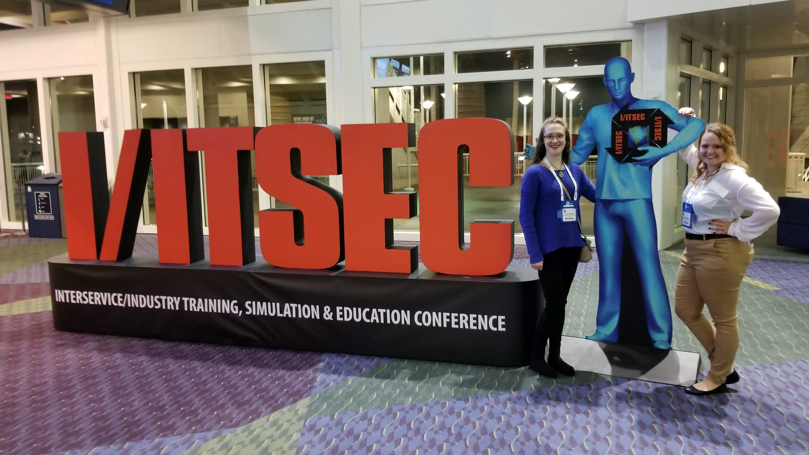

# aughey.com Main Page

This is a place to find additional information about John Aughey - above and beyond what might be found in a Resume or online biography.

Of course, an [online copy of my resume](resume.md) can be found here.  However, I'd like to share additional activities that I am
particularly proud of that contribute to my profressional character.

# [Rosati-Kain 2019 I/ITSEC Trip](IITSEC_rk/README.md)

In 2019, I helped arrange and mentor two students from Rosati-Kain high school to attend the [I/ITSEC conference](https://www.iitsec.org/) in
Orlando Florida.  This effort was a special event within the Rosati-Kain coding club.

# [Rosati-Kain Coding Club](rk_coding/README.md)

Between 2016 and 2019, while my oldest daughter was attending, I founded the coding club at Rosati-Kain.  I mentored student-driven
projects including learning game design by creating a virtual world of their high school, building a Google Voice personal assistant, [World Wide Technology](https://www.wwt.com/) STEM Student Forum,
and the above mentioned [trip to I/ITSEC](IITSEC_rk/README.md).

