# Rosati-Kain Koding Klub

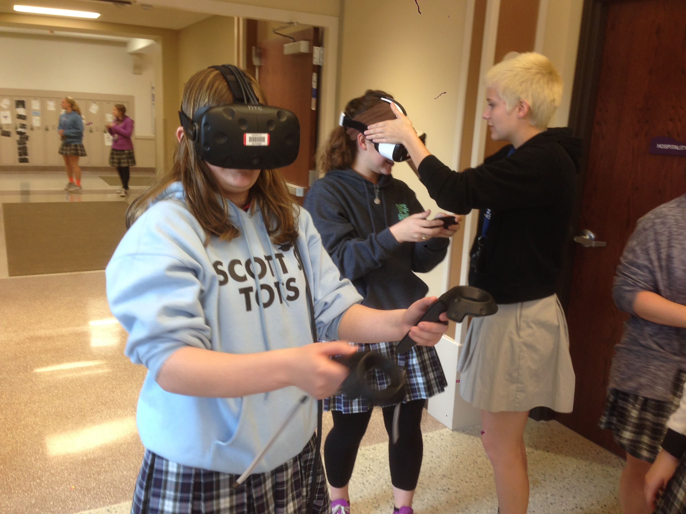

The coding club was formed in 2016, exposing students to advanced reality technologies to include the HTC Vive.

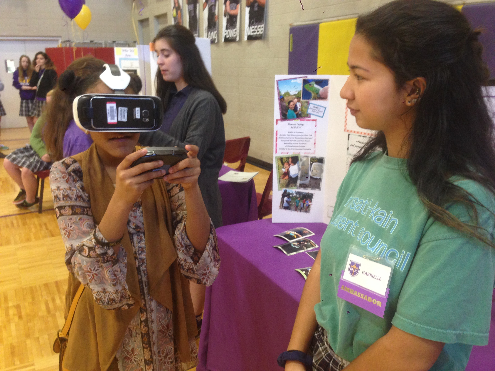

Student-built their own virtual world of their high school using Sketchup and Unity.  Here they are presenting their work to prospective 8th grade students at a new student open house event.

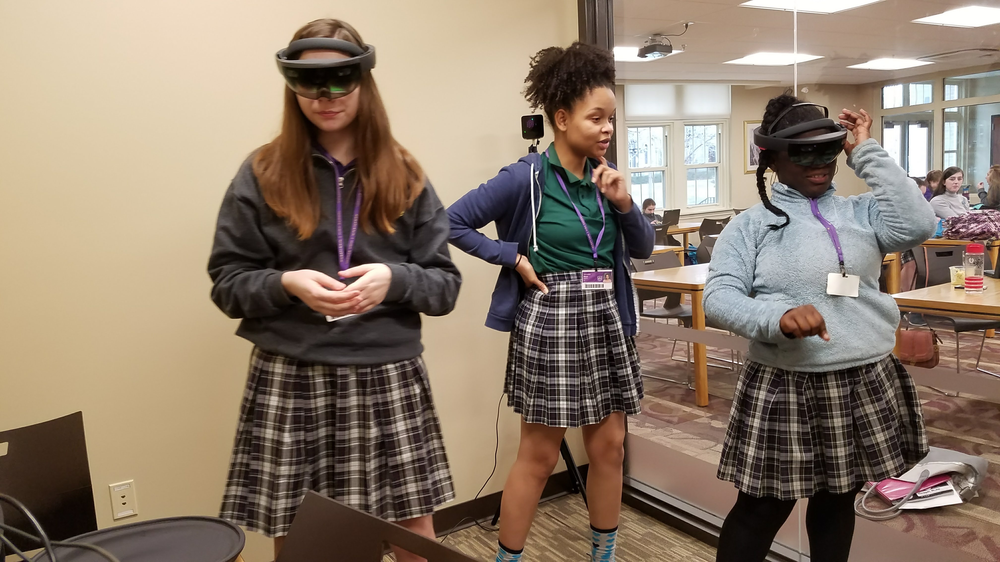

John enabled students to experence augmented reality using Hololens headsets.

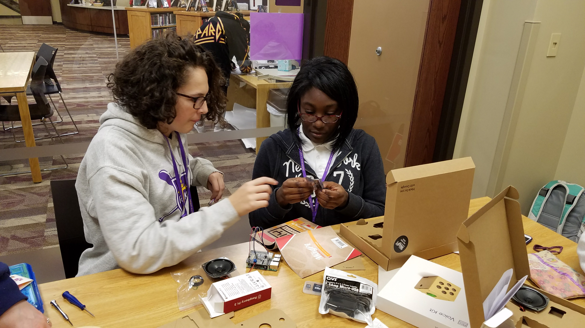

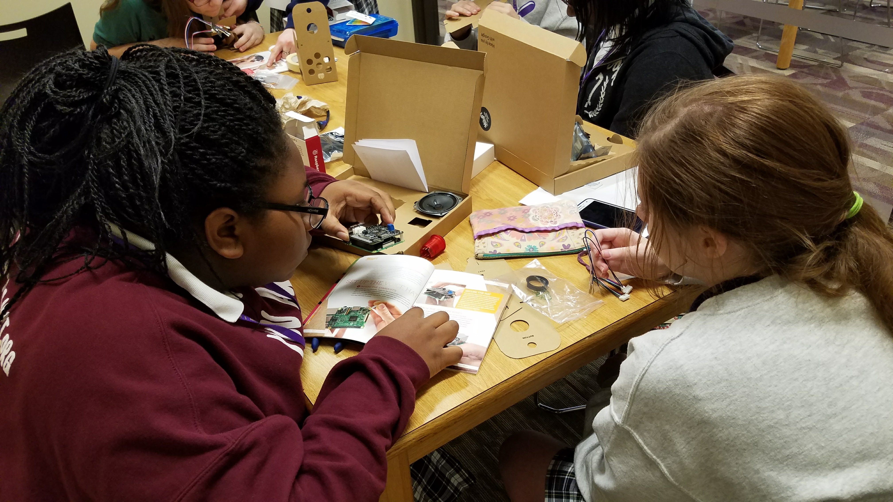

In 2017, the learning project was to put together a Raspberry PI based Google Voice kit.  Here the students
are assembling their project.

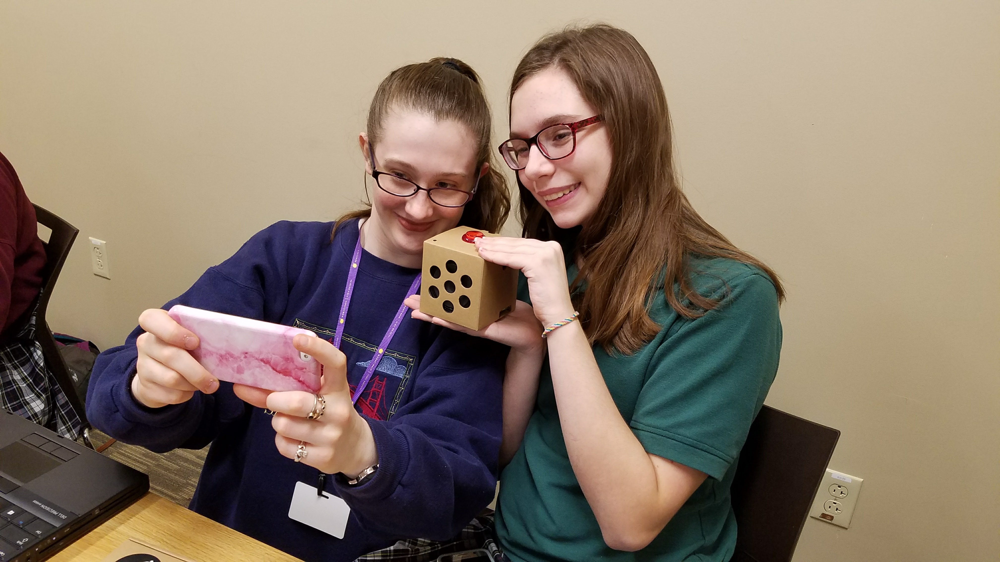

Completing the effort themselves is a sense of pride and personal accomplishment.

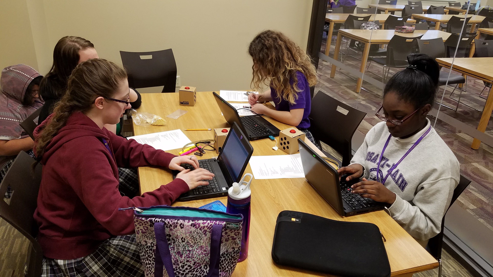

Once built, the effort turns to their laptops to customize the behavior.

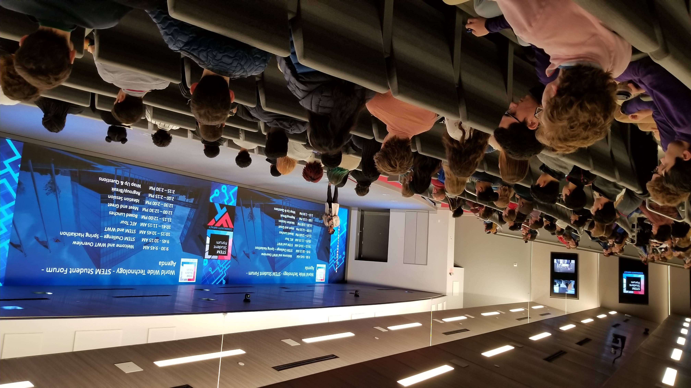

In 2019, Rosati-Kain participated in the World Wide Technology STEM Student Forum.

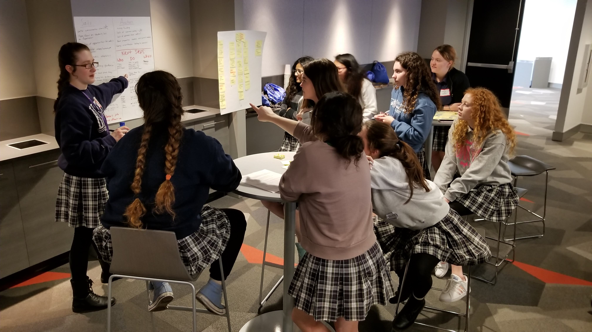

Their project required collaboration across the entire skillset of the team.

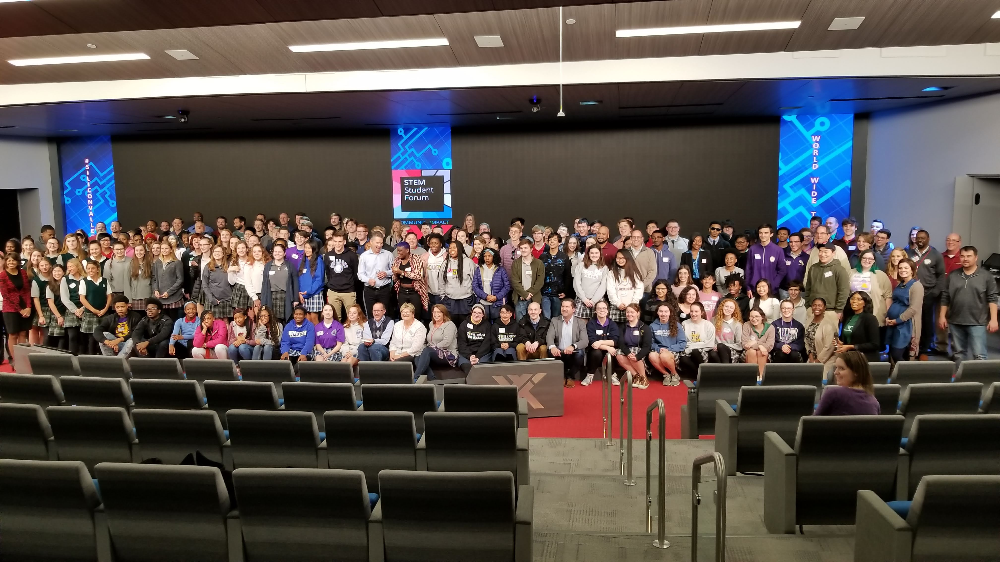

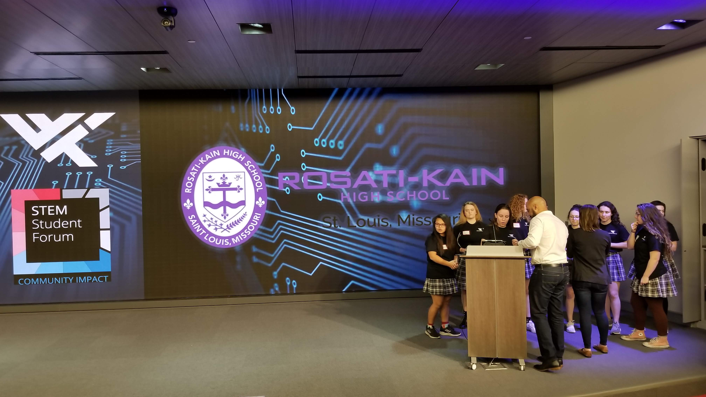

A month later after days of hard work they present their solution to the organizers and fellow peers.

